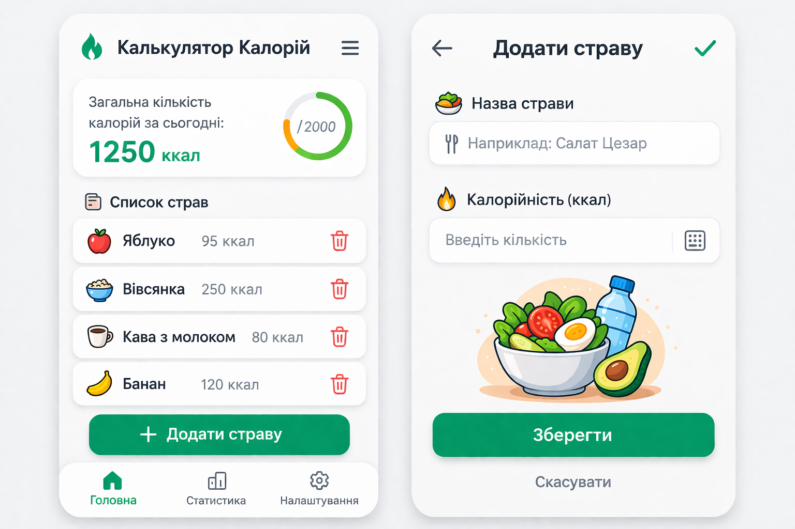

# 🧪 Лабораторна робота №3 Варіант 7
**Тема:** Software Development Life Cycle (SDLC) — Життєвий цикл програмного забезпечення

## 🎯 Мета
Закріпити знання про SDLC, пройшовши всі його основні етапи на прикладі власного міні-проєкту.


## 1. Планування
Мета: створити простий застосунок калькулятор калорій, який дозволяє користувачу вводити назви страв та їх калорійність, а також автоматично підраховувати загальну кількість калорій за день.

Користувач повинен мати можливість додавати продукти, переглядати список з’їдених страв та бачити загальну кількість калорій.

## 2. Аналіз вимог (User stories)
1) Як користувач, я хочу додавати нову страву з калоріями, щоб вести облік харчування. ✅ (Must have)

2) Як користувач, я хочу бачити список усіх доданих страв, щоб контролювати свій раціон. ✅ (Must have)

3) Як користувач, я хочу бачити загальну суму калорій за день, щоб контролювати споживання.

4) Як користувач, я хочу видаляти страви зі списку, щоб виправляти помилки.

5) Як користувач, я хочу очищати список за день, щоб почати підрахунок заново.

## 3. Дизайн (Прототип)
 

## 4. Реалізація (Псевдокод)
```pseudo
function addMeal(mealName, calories):
    if mealName is empty OR calories <= 0:
        return "Error: invalid input"
    else:
        meal = createMeal(mealName, calories)
        mealList.add(meal)
        totalCalories = totalCalories + calories
        return "Meal added successfully"
```  

## 5. Тестування
1)Додати страву “Яблуко – 95 калорій” → вона з’являється у списку.

2) Додати страву без назви → система видає помилку.

3) Видалити страву зі списку → вона зникає і загальна кількість калорій зменшується.

## 6. Висновки
Для такого невеликого застосунку найкраще підходить Agile-модель SDLC, оскільки вона дозволяє поступово додавати нові функції та швидко тестувати їх. Наприклад, у майбутньому можна додати базу продуктів або графік споживання калорій. Agile забезпечує гнучкість і швидке вдосконалення програми.
